# CMOS Inverter Sizing Ratio (KR) Analysis using Cadence Virtuoso

## Overview

This project investigates how the sizing ratio (KR) affects the static and dynamic performance of a CMOS inverter.

The following parameters were analyzed:

• Switching Threshold  
• Noise Margins  
• Propagation Delay  

Three CMOS inverter designs were implemented using Cadence Virtuoso with different sizing ratios:

KR = 0.5  
KR = 1  
KR = 2  

The goal is to determine the optimal transistor sizing for robust and balanced digital logic operation.

---

# Tools Used

Cadence Virtuoso  
ADE L Simulation Environment  

Technology Node: 180 nm CMOS  
Supply Voltage: 1.8 V  

---

# CMOS Inverter

A CMOS inverter is a fundamental digital logic gate that performs the NOT operation.

It consists of two complementary transistors:

PMOS (pull-up network)  
NMOS (pull-down network)

Operation:

| Input | PMOS | NMOS | Output |
|------|------|------|------|
| 0 | ON | OFF | 1 |
| 1 | OFF | ON | 0 |

When the input is LOW, PMOS conducts and pulls the output to VDD.

When the input is HIGH, NMOS conducts and pulls the output to ground.

---

# Voltage Transfer Characteristic (VTC)

The Voltage Transfer Characteristic describes the relationship between input and output voltage.

Vout = f(Vin)

Important parameters extracted from the VTC:

• Switching Threshold Voltage  
• Noise Margins  
• Output Voltage Levels

The switching threshold occurs when:

Vin = Vout

At this point both transistors conduct equal current.

---

# CMOS Inverter Operation and VTC

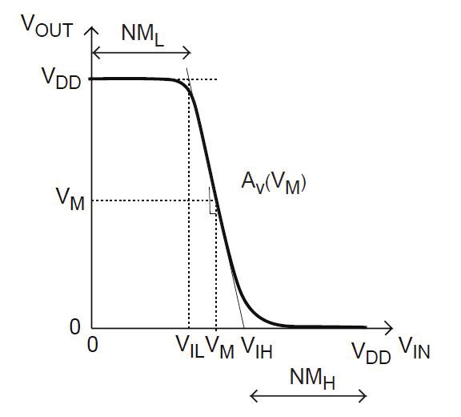

The VTC curve determines:

• switching point  
• noise margin  
• gain of inverter

Propagation delay is defined as the time taken for the output to respond to input changes.

---

# Process Parameters

The current driving capability of a MOS transistor depends on the process transconductance parameter:

k' = μCox

For NMOS and PMOS:

Kn = μnCox  
Kp = μpCox

Since electron mobility is higher than hole mobility:

μn > μp

Therefore NMOS devices conduct more current than PMOS devices with equal dimensions.

To balance the inverter, the PMOS width must be increased.

---

# Sizing Ratio (KR)

The sizing ratio KR defines the relative strength of pull-up and pull-down networks.

KR = (Kp / Kn) × ((W/L)p / (W/L)n)

Where:

W = transistor width  
L = transistor length

For symmetric inverter operation:

KR = 1

This results in a switching threshold near:

VDD / 2

If:

KR > 1 → PMOS stronger → switching point shifts toward VDD  
KR < 1 → NMOS stronger → switching point shifts toward ground

---

# Noise Margins

Noise margins represent how much noise a circuit can tolerate without logic errors.

Key voltages:

VOH → Output HIGH voltage  
VOL → Output LOW voltage  
VIL → Maximum input interpreted as LOW  
VIH → Minimum input interpreted as HIGH

Noise margins are calculated as:

NMH = VOH − VIH  
NML = VIL − VOL

For a reliable inverter:

NMH ≈ NML

---

# Propagation Delay

Propagation delay measures how fast the output responds to an input transition.

Two delays are defined:

tphl → HIGH to LOW delay  
tplh → LOW to HIGH delay

Average delay:

tp = (tplh + tphl) / 2

Balanced transistor sizing produces:

tplh ≈ tphl

---

# Design Methodology

Three inverter configurations were designed with different KR values.

NMOS dimensions were kept constant:

Length = 180 nm  
Width = 850 nm

PMOS width was varied to achieve different KR values.

| KR | PMOS Width |
|----|-----------|
| 0.5 | 1.7 µm |
| 1 | 3.4 µm |
| 2 | 6.8 µm |

The baseline design was obtained empirically by adjusting PMOS width until:

Vsth ≈ VDD / 2

Which equals approximately:

0.9 V

---

# CMOS Inverter Schematics

### KR = 1

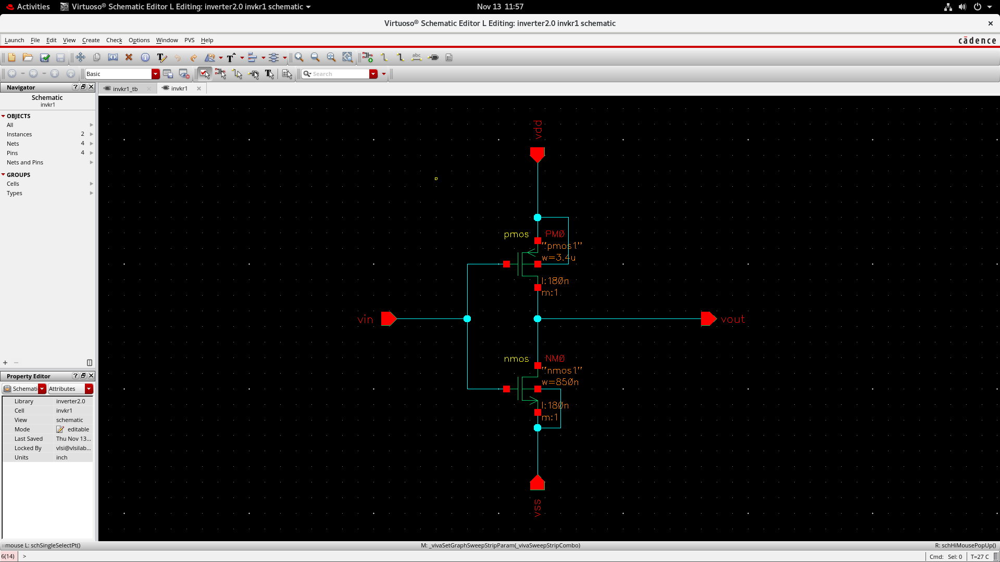

---

### KR = 2

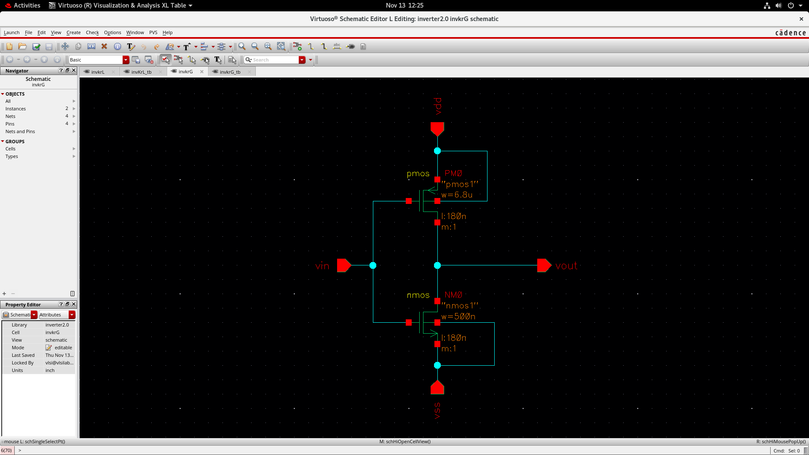

---

### KR = 0.5

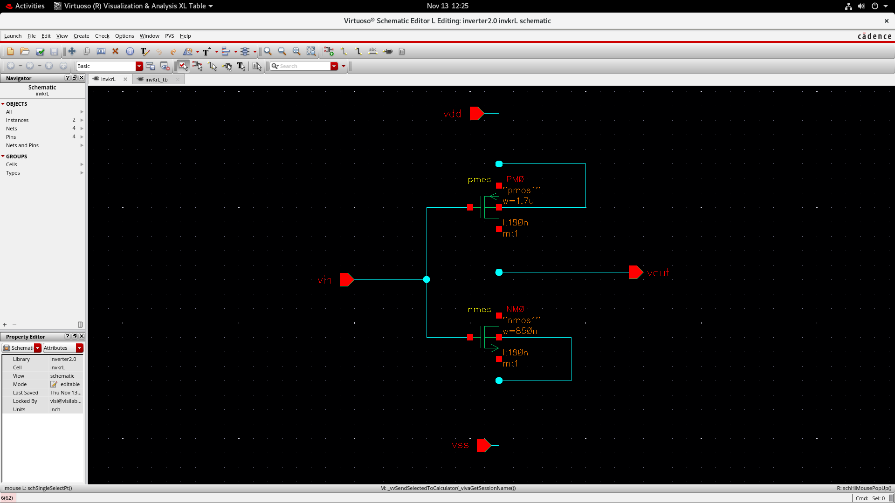

---

# Testbench Setup

Each inverter was simulated using a dedicated testbench.

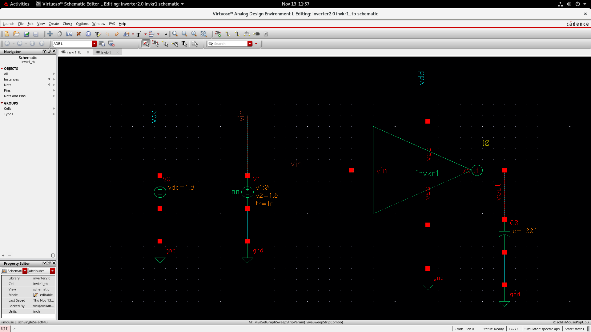

Input signal:

0 V → 1.8 V square wave

Simulation parameters:

Period = 20 ns  
Rise time = 1 ns  
Fall time = 1 ns  
Pulse width = 10 ns  

Load capacitance:

100 fF

---

# Simulation Results

## KR = 1

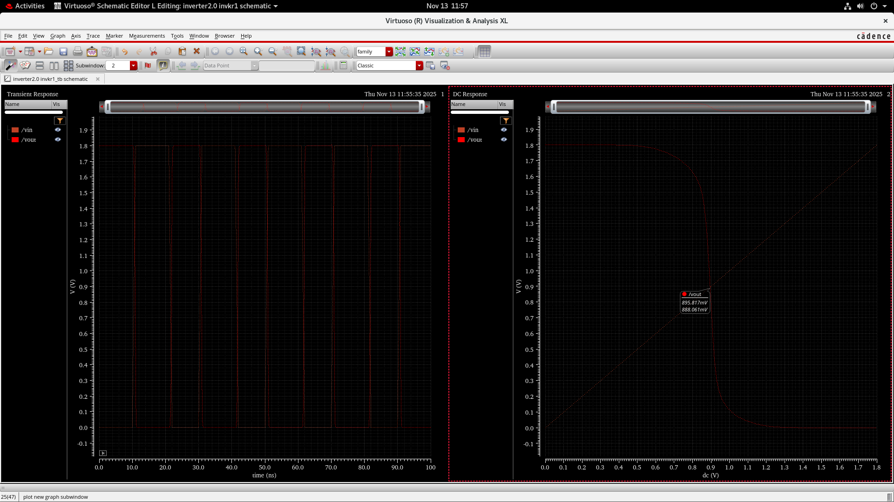
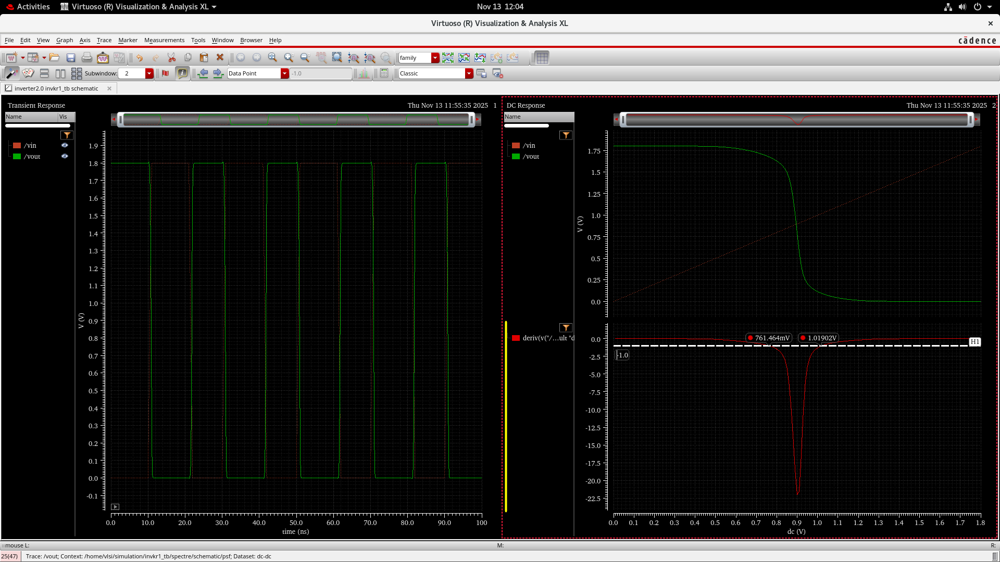

---

## KR = 0.5

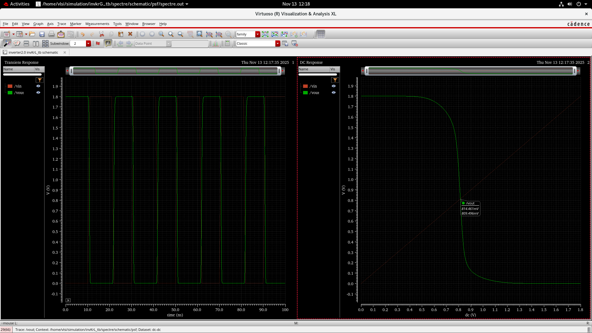
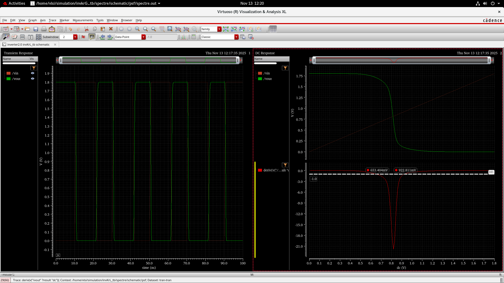

---

## KR = 2

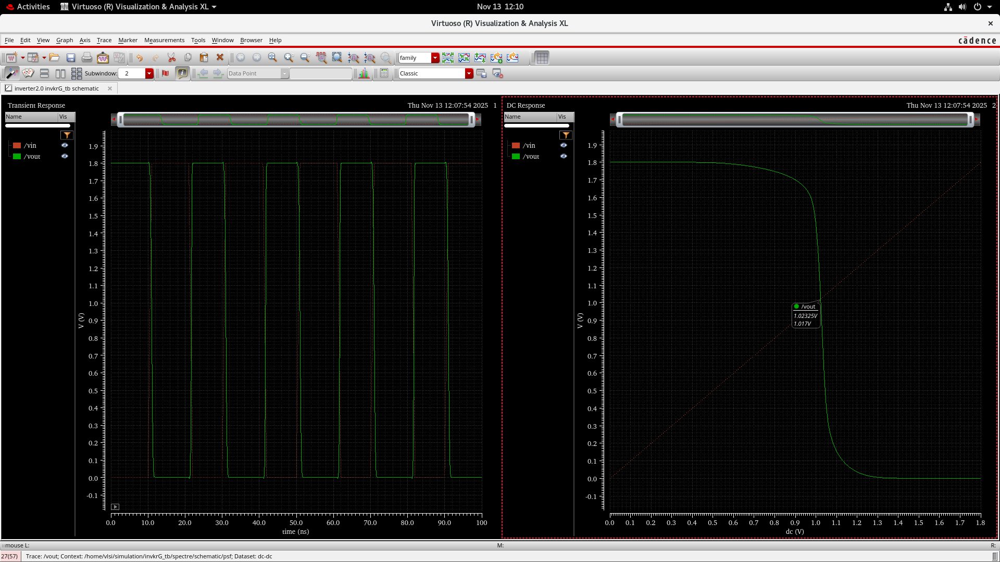
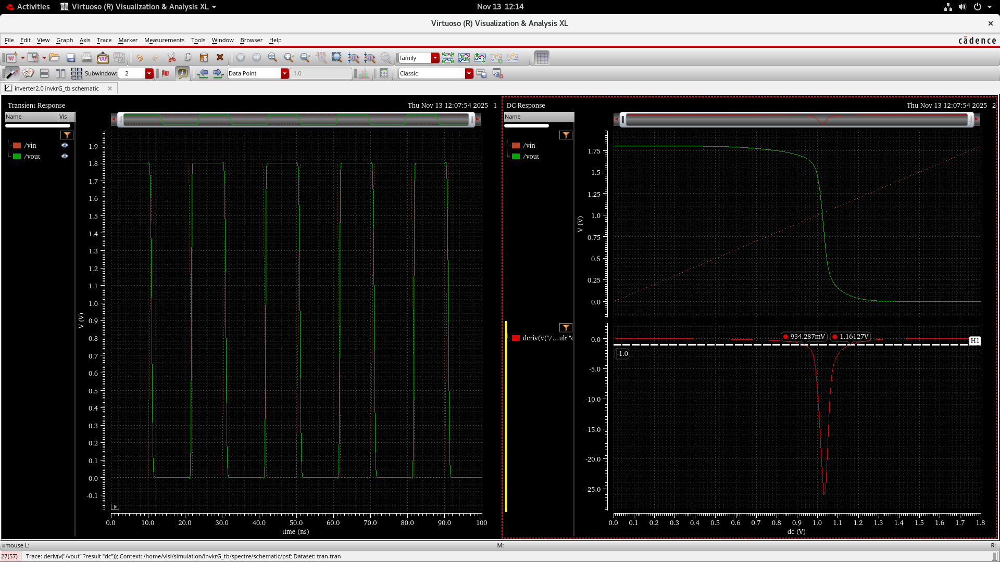

---

# ADE Calculator Results

Output voltage levels were extracted using the Cadence ADE calculator.

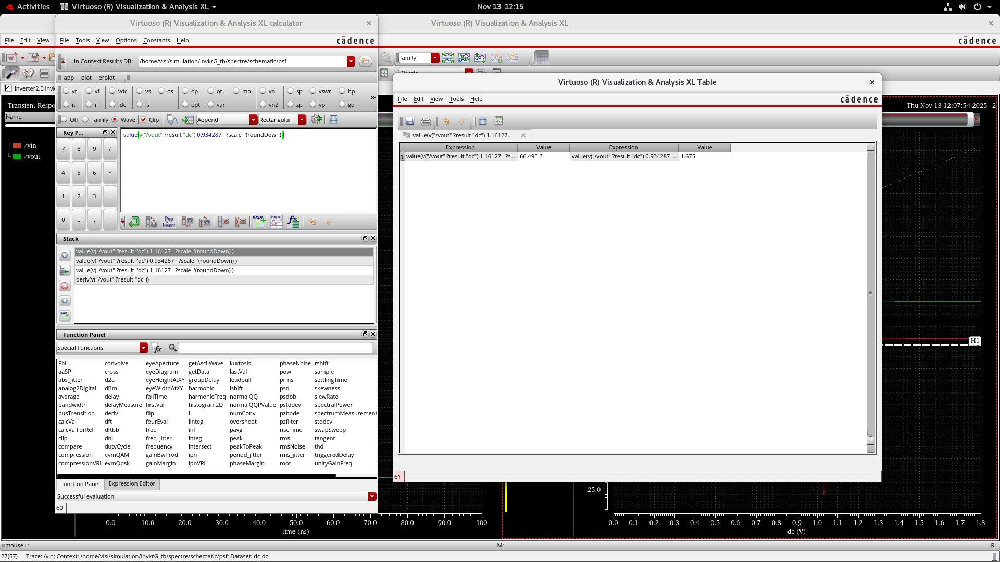

---

# Propagation Delay Measurement

Propagation delays were measured from transient simulations.

## KR = 0.5

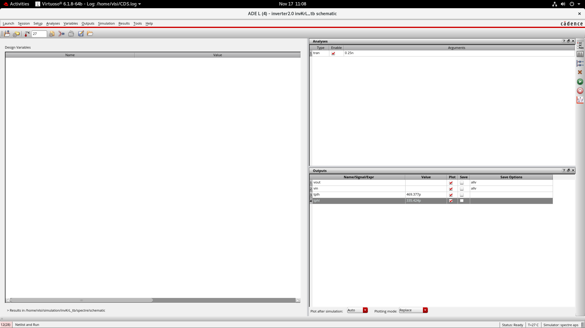

---

## KR = 1

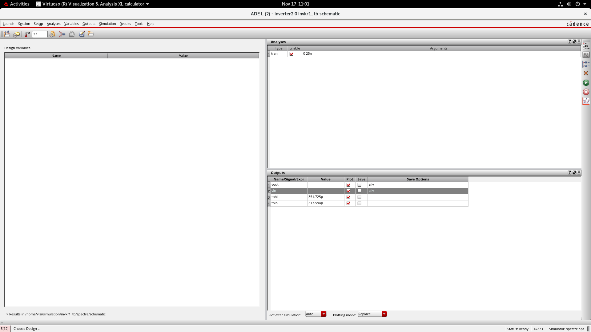

---

## KR = 2

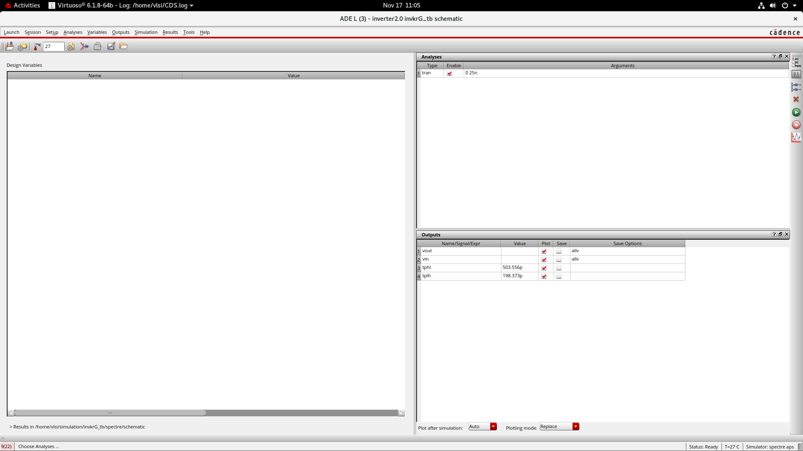

---

# Results Table

| Parameter | KR = 0.5 | KR = 1 | KR = 2 |
|-----------|---------|--------|--------|
| Vsth | 814.461 mV | 895.817 mV | 1.0232 V |
| VIL | 653.404 mV | 761.464 mV | 934.287 mV |
| VIH | 922.811 mV | 1.01902 V | 1.6127 V |
| VOL | 103.3 mV | 102.5 mV | 66.49 mV |
| VOH | 1.707 V | 1.678 V | 1.675 V |
| NML | 550.104 mV | 658.964 mV | 867.797 mV |
| NMH | 784.189 mV | 658.98 mV | 62.3 mV |
| tplh | 469.377 ps | 351.725 ps | 503.556 ps |
| tphl | 335.424 ps | 317.594 ps | 198.373 ps |
| tp | 402.4 ps | 334.659 ps | 350.964 ps |

---

# Observations

KR = 1 provides the most balanced inverter.

Key findings:

• Switching threshold occurs near VDD / 2  
• Noise margins are symmetric  
• Propagation delays are balanced  
• Circuit shows fastest and most stable operation  

When KR deviates from 1:

KR < 1 → NMOS dominates  
KR > 1 → PMOS dominates  

This creates asymmetry in noise margins and switching delay.

---

# Conclusion

The analysis demonstrates that transistor sizing significantly influences CMOS inverter performance.

Among the tested configurations:

KR = 1 provides the optimal design.

This configuration achieves:

• symmetric noise margins  
• switching threshold at VDD / 2  
• balanced propagation delay  

Therefore, CMOS inverter design should aim for KR ≈ 1 by scaling PMOS width relative to NMOS strength.

---

# Authors

Manash Jyoti Barman  
Prachi Sarma  
Akash Kumar Prasad  

Department of Electronics and Communication Engineering  
Tezpur University

Course: CMOS Design (EC310)

Instructor: Dr. Biplob Mondal
